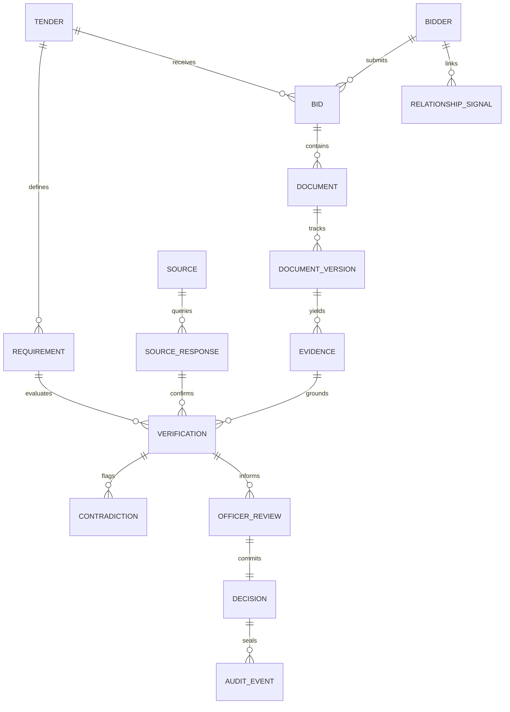

# DATA MODEL SPECIFICATION — PRAMAAN

**Document Status:** Conceptual & Logical Data Schema Specification  
**Core Architectural Rule:** *Evidence is first-class structured relational data — never transient text inside an LLM response.*  

---

## 1. Entity Relationship (ER) Conceptual Graph



---

## 2. Core Entity Definitions

### 2.1 `Tender`
- **Purpose:** Represents the master public procurement tender issued by CPCL on GeM.
- **Why it exists:** Serves as the root context defining the procurement scope, estimated budget, submission deadlines, and statutory eligibility clauses.
- **Key Fields:**
  - `tender_id` (PK, String): Unique tender reference (e.g., `CPCL-2026-TND-8941`).
  - `title` (String): Tender title (e.g., *"Procurement of High-Pressure Seamless Steel Pipes & Fittings"*).
  - `issuing_authority` (String): e.g., `"CPCL Refinery, Manali, Chennai"`.
  - `published_date` (DateTime UTC): Date published on GeM.
  - `closing_date` (DateTime UTC): Bid submission deadline.
  - `evaluation_date` (DateTime UTC): Official date of technical evaluation opening.
  - `estimated_value_inr` (Decimal): e.g., `250000000.00` (₹25 Cr).
  - `tender_category` (Enum): `GOODS` | `SERVICES` | `WORKS`.
  - `status` (Enum): `DRAFT` | `PUBLISHED` | `UNDER_EVALUATION` | `AWARDED`.
- **Example Record:**
  ```json
  {
    "tender_id": "CPCL-2026-TND-8941",
    "title": "Supply of API-5L Line Pipes for CPCL Manali Refinery",
    "issuing_authority": "Chennai Petroleum Corporation Limited (CPCL)",
    "published_date": "2026-08-15T09:00:00Z",
    "closing_date": "2026-09-15T15:00:00Z",
    "evaluation_date": "2026-09-29T10:00:00Z",
    "estimated_value_inr": 250000000.00,
    "tender_category": "GOODS",
    "status": "UNDER_EVALUATION"
  }
  ```

---

### 2.2 `Requirement`
- **Purpose:** Specific statutory, financial, or technical qualification clauses defined in the tender.
- **Why it exists:** Provides the target predicate against which submitted evidence is deterministically validated.
- **Key Fields:**
  - `requirement_id` (PK, String): e.g., `REQ-TND-001`.
  - `tender_id` (FK, String): Reference to parent tender.
  - `clause_reference` (String): e.g., `"Clause 4.2 - Financial Criteria"`.
  - `requirement_category` (Enum): `STATUTORY` | `FINANCIAL` | `TECHNICAL` | `PREFERENCE` | `INTEGRITY`.
  - `rule_type` (Enum): `THRESHOLD` | `EXACT_MATCH` | `REGISTRY_STATUS` | `ARITHMETIC_RECOMPUTE` | `DOCUMENT_EXISTS`.
  - `rule_definition` (JSON): Deterministic predicate schema (e.g., `{"operator": ">=", "field": "average_turnover", "threshold": 100000000.00}`).
  - `is_mandatory` (Boolean): True if non-compliance causes disqualification.
- **Example Record:**
  ```json
  {
    "requirement_id": "REQ-TND-001",
    "tender_id": "CPCL-2026-TND-8941",
    "clause_reference": "Clause 4.2",
    "title": "Minimum Average Annual Turnover (Last 3 Financial Years)",
    "requirement_category": "FINANCIAL",
    "rule_type": "THRESHOLD",
    "rule_definition": {
      "field": "average_turnover_last_3_fy",
      "operator": ">=",
      "threshold_inr": 100000000.00,
      "currency": "INR"
    },
    "is_mandatory": true
  }
  ```

---

### 2.3 `Bidder` & `Bid`
- **Purpose:** Identifies the legal commercial entity submitting an offer and the specific bid bundle.
- **Why it exists:** Distinguishes the persistent corporate identity across multiple tenders from a specific tender submission packet.
- **Key Fields (`Bidder`):**
  - `bidder_id` (PK, String): Canonical identifier (e.g., `BIDDER-CORP-002`).
  - `legal_name` (String): Registered corporate name.
  - `primary_pan` (String, Indexed): 10-character PAN.
  - `primary_gstin` (String, Indexed): 15-character GSTIN.
  - `udyam_number` (String, Nullable): Udyam registration ID.
  - `registered_address` (String): Official legal address.
- **Key Fields (`Bid`):**
  - `bid_id` (PK, String): Unique submission ID (e.g., `BID-2026-091-B2`).
  - `tender_id` (FK, String): Reference to Tender.
  - `bidder_id` (FK, String): Reference to Bidder.
  - `submission_timestamp` (DateTime UTC): Exact GeM submission time.
  - `declared_turnover_inr` (Decimal, Nullable): Bidder self-declared turnover.
  - `declared_mii_percentage` (Decimal, Nullable): Declared local-content percentage.
  - `overall_triage_rank` (Integer): Priority score calculated by uncertainty $\times$ materiality.

---

### 2.4 `Document` & `DocumentVersion`
- **Purpose:** Manages raw PDF attachments uploaded by bidders (certificates, proposals, declarations).
- **Why it exists:** Provides exact cryptographic integrity for submitted files and ensures file version immutability.
- **Key Fields:**
  - `document_id` (PK, String): e.g., `DOC-B2-CA-CERT`.
  - `bid_id` (FK, String): Associated bid.
  - `original_filename` (String): e.g., `"CA_Turnover_Certificate_Signed.pdf"`.
  - `sha256_hash` (String, Unique): SHA-256 hash of raw file bytes.
  - `storage_uri` (String): S3/MinIO bucket path.
  - `classified_type` (Enum): `GST_CERT` | `UDYAM_CERT` | `CA_TURNOVER` | `BALANCE_SHEET` | `OEM_AUTH` | `MII_DECLARATION` | `CPPP_AFFIDAVIT` | `TECHNICAL_PROPOSAL`.
  - `page_count` (Integer): Total pages.
  - `is_digital_pdf` (Boolean): True if vector text; False if scanned bitmap requiring OCR.
  - `adversarial_flag` (Boolean): Set True if prompt-injection directive discovered.

---

### 2.5 `Evidence` (The First-Class Provenance Primitive)
- **Purpose:** Stores an atomic, verifiable claim extracted from a document or registry.
- **Why it exists:** **CRITICAL.** Verifications must point to an explicit fact with coordinates and confidence, never to an ephemeral chat response.
- **Key Fields:**
  - `evidence_id` (PK, String): e.g., `EVD-2026-B2-01`.
  - `document_id` (FK, String): Source document.
  - `page_number` (Integer): 1-indexed document page.
  - `bounding_box` (JSON Array): Normalized coordinates `[ymin, xmin, ymax, xmax]`.
  - `claim_field` (String): Canonical field name (e.g., `"turnover_fy_2023_24"`).
  - `extracted_value` (JSON): Structured payload (number, string, date, object).
  - `raw_text_snippet` (String): Verbatim text extracted from the document.
  - `extraction_confidence` (Float): Model confidence score ($0.00$ to $1.00$).
  - `provenance_type` (Enum): `PDF_NATIVE_TEXT` | `OCR_EXTRACTION` | `TABLE_PARSER` | `REGISTRY_API`.
  - `data_provenance_badge` (Enum): `REAL` | `SYNTHETIC` | `MOCK` | `CACHED` | `DERIVED`.
- **Example Record:**
  ```json
  {
    "evidence_id": "EVD-2026-B2-01",
    "document_id": "DOC-B2-CA-CERT",
    "page_number": 1,
    "bounding_box": [0.45, 0.12, 0.49, 0.65],
    "claim_field": "average_turnover_last_3_fy",
    "extracted_value": {
      "amount": 90000000.00,
      "currency": "INR",
      "years": ["2021-22", "2022-23", "2023-24"]
    },
    "raw_text_snippet": "This is to certify that the Average Annual Turnover of M/s Bharat Valve Corp for the preceding three financial years is INR 9.00 Crores (Rupees Nine Crores only).",
    "extraction_confidence": 0.98,
    "provenance_type": "PDF_NATIVE_TEXT",
    "data_provenance_badge": "SYNTHETIC"
  }
  ```

---

### 2.6 `Source` & `SourceResponse`
- **Purpose:** Represents external authoritative registries (GSTN, MCA21, Udyam) and logs every external query payload.
- **Why it exists:** Decouples external data retrieval from internal evaluation and captures source downtime.
- **Key Fields:**
  - `source_id` (PK, String): e.g., `SRC-GSTN-GATEWAY`.
  - `source_name` (String): `"Goods and Services Tax Network"`.
  - `adapter_mode` (Enum): `LIVE` | `MOCK_DEMO`.
  - `health_status` (Enum): `HEALTHY` | `DEGRADED` | `OFFLINE`.
  - `response_id` (PK, String): Query transaction ID.
  - `query_identifier` (String): e.g., `"33AAACB1234F1Z1"`.
  - `status_code` (Integer): e.g., `200` or `504`.
  - `raw_payload` (JSON): Full JSON payload returned by registry.
  - `latency_ms` (Integer): Response duration in ms.
  - `queried_at` (DateTime UTC): Timestamp.

---

### 2.7 `Verification`
- **Purpose:** Represents the deterministic evaluation of an eligibility Requirement against one or more Evidence records and Source responses.
- **Why it exists:** Holds the core **Three-State Verdict** and structured reason codes.
- **Key Fields:**
  - `verification_id` (PK, String): e.g., `VRF-2026-B2-REQ1`.
  - `bid_id` (FK, String): Evaluated bid.
  - `requirement_id` (FK, String): Evaluated tender clause.
  - `verdict` (Enum): `VERIFIED` | `CONTRADICTED` | `UNVERIFIABLE` | `PENDING_REVIEW`.
  - `confidence_score` (Float): Calibrated aggregate confidence.
  - `primary_evidence_id` (FK, String, Nullable): Core supporting evidence.
  - `reason_code` (String): Structured machine-readable code (e.g., `ERR_TURNOVER_BELOW_THRESHOLD`, `ERR_CROSS_DOC_CONTRADICTION`, `ERR_SOURCE_TIMEOUT`).
  - `verdict_summary` (String): Plain-English factual explanation citing exact numbers.
  - `evaluated_at` (DateTime UTC): Verification timestamp.

---

### 2.8 `Contradiction`
- **Purpose:** Explicit entity tracking conflicts between two submitted documents or between a document and a registry.
- **Why it exists:** Transforms vague discrepancies into actionable investigation cards with side-by-side evidence pointers.
- **Key Fields:**
  - `contradiction_id` (PK, String): e.g., `CTR-2026-001`.
  - `bid_id` (FK, String): Associated bid.
  - `contradiction_type` (Enum): `IN_BID_DOCUMENT_MISMATCH` | `DOCUMENT_REGISTRY_MISMATCH` | `ARITHMETIC_RECOMPUTE_MISMATCH`.
  - `field_name` (String): e.g., `"average_annual_turnover"`.
  - `evidence_a_id` (FK, String): First evidence reference (e.g., Bid Form).
  - `evidence_b_id` (FK, String): Second evidence reference (e.g., CA Certificate).
  - `value_a` (String): e.g., `"INR 12.00 Crores"`.
  - `value_b` (String): e.g., `"INR 9.00 Crores"`.
  - `delta_description` (String): `"Declared turnover exceeds CA certified turnover by INR 3.00 Crores (+33.3%)"`.
  - `severity` (Enum): `CRITICAL` (causes threshold failure) | `WARNING` | `INFORMATIONAL`.

---

### 2.9 `RelationshipSignal` (Cross-Bidder Intelligence)
- **Purpose:** Stores an anomaly signal indicating shared infrastructure or collusion indicators across multiple bidders in a tender.
- **Why it exists:** Solves the multi-bidder collusion blindspot without making unprovable "fraud" claims.
- **Key Fields:**
  - `signal_id` (PK, String): e.g., `SIG-REL-001`.
  - `tender_id` (FK, String): Target tender.
  - `bidder_a_id` (FK, String): First involved bidder.
  - `bidder_b_id` (FK, String): Second involved bidder.
  - `signal_type` (Enum): `SHARED_BANK_ACCOUNT` | `SHARED_DIRECTOR_DIN` | `SHARED_PHYSICAL_ADDRESS` | `SHARED_PHONE_EMAIL` | `BOILERPLATE_TEXT_SIMILARITY` | `SHARED_DOCUMENT_METADATA`.
  - `shared_attribute_key` (String): e.g., `"bank_account_ifsc"`.
  - `shared_attribute_value` (String): e.g., `"HDFC0001234 : 50200088991122"`.
  - `similarity_score` (Float, Nullable): For text/proposal similarity ($0.00$ to $1.00$).
  - `status` (Enum): `FLAGGED_FOR_OFFICER` | `CONFIRMED_BENIGN` | `REFERRED_TO_VIGILANCE`.

---

### 2.10 `OfficerReview` & `Decision`
- **Purpose:** Captures human intervention, overrides, clarifications, and the final qualification verdict.
- **Why it exists:** Enforces statutory officer accountability; guarantees the human remains the legally liable decision-maker.
- **Key Fields:**
  - `review_id` (PK, String): e.g., `REV-2026-001`.
  - `verification_id` (FK, String): Associated verification finding.
  - `officer_id` (String): Officer employee ID / email.
  - `officer_action` (Enum): `ACCEPT_SYSTEM_VERDICT` | `OVERRIDE_TO_VERIFIED` | `OVERRIDE_TO_CONTRADICTED` | `REQUEST_CLARIFICATION` | `ESCALATE_TO_LEGAL`.
  - `override_reason_category` (Enum): `CLARIFICATION_ACCEPTED` | `SUB_CONTRACTOR_EXCEPTION` | `TYPOGRAPHICAL_ERROR` | `POLICY_EXEMPTION` | `OTHER`.
  - `officer_justification` (Text): Mandatory detailed rationale (minimum 30 chars).
  - `reviewed_at` (DateTime UTC): Timestamp.

---

### 2.11 `AuditEvent` (Tamper-Evident Hash Chain)
- **Purpose:** Append-only ledger recording all lifecycle events in the system.
- **Why it exists:** Provides cryptographic proof that records were not retroactively altered.
- **Key Fields:**
  - `event_index` (PK, BigInt, Auto-Increment): Monotonic sequence number (1, 2, 3...).
  - `event_id` (UUID, Unique): Global unique ID.
  - `timestamp` (DateTime UTC): Accurate UTC timestamp.
  - `actor_type` (Enum): `SYSTEM_ENGINE` | `AI_SERVICE` | `REGISTRY_ADAPTER` | `OFFICER_USER`.
  - `actor_id` (String): Identifier of actor.
  - `event_type` (Enum): `EVIDENCE_EXTRACTED` | `VERDICT_GENERATED` | `CONTRADICTION_FLAGGED` | `OFFICER_OVERRIDE` | `BID_QUALIFIED` | `BID_DISQUALIFIED`.
  - `payload_json` (JSON): Canonicalized event payload.
  - `previous_hash` (String): 64-character hex SHA-256 hash of preceding row.
  - `current_hash` (String): 64-character hex SHA-256 hash of this record.
- **Cryptographic Hash Formula:**
  $$\text{CurrentHash} = \text{SHA256}(\text{event\_index} \,\|\, \text{previous\_hash} \,\|\, \text{timestamp} \,\|\, \text{event\_type} \,\|\, \text{SHA256}(\text{payload\_json}))$$
